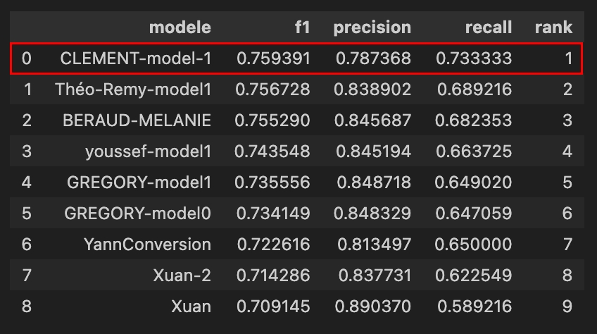

# Conversion Rate Machine Learning

## Introduction

[www.datascienceweekly.org](www.datascienceweekly.org) est une newsletter célèbre élaborée par des data scientists indépendants. Tout le monde peut enregistrer son adresse e-mail sur ce site pour recevoir des actualités hebdomadaires sur la science des données et ses applications !

Les data scientists qui ont créé la newsletter aimeraient mieux comprendre le comportement des utilisateurs visitant leur site web. Ils aimeraient savoir s'il est possible de construire un modèle qui prédit si un utilisateur donné s'abonnera à la newsletter, en utilisant seulement quelques informations sur l'utilisateur. Ils aimeraient analyser les paramètres du modèle pour mettre en évidence les caractéristiques importantes expliquant le comportement des utilisateurs, et peut-être découvrir un nouveau levier d'action pour améliorer le taux de conversion de la newsletter.

## Vainqueur du Conversion Rate Challenge de Jedha 🏆

## Clone du repo

Pour cloner le repo, utilisez la commande suivante :

git clone https://github.com/Clementbroeders/conversion-rate-ml.git

## Comment ça marche ?

Pour réaliser cette étude, datascienceweekly nous a fourni un ensemble de données sur leurs utilisateurs, incluant l'information sur s'ils se sont abonnés ou non.

On utilisera l'algorithme de machine learning XGboost, qui est celui qui m'a donné la plus grande satisfaction en temps de traitement et de résultat.

Plusieurs algorithmes ont été testés : SGD, Bagging Logistic Regression, AdaBoost Logistic Regression, Gradient Boosting, Random Forest, SVC

Vous pouvez retrouver les tests dans le notebook suivant : `machine-learning-notebook.ipynb`

## Etapes

Le notebook est entièrement automatisé et disponible à la racine du repo : `notebook.ipynb`

Une fois lancé, le notebook va lancer la création du modèle puis l'enregistrer au chemin suivant : `src/model.joblib`

Les résultats sont consutables dans le notebook, avec les explications, y compris certains visuels comme les matrices de confusion.